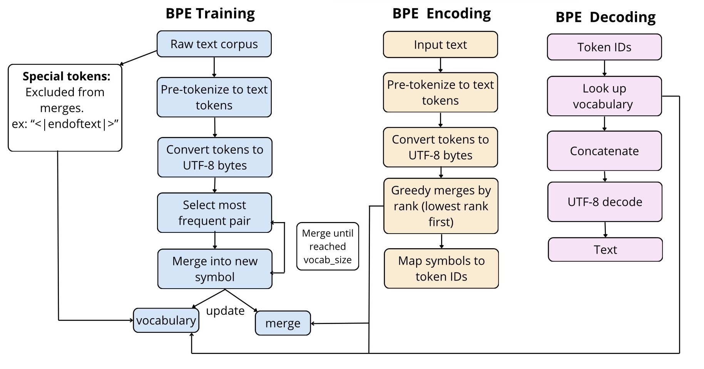

# A BPE (Byte Pair Encoding) Implementation from Scratch

This repository contains my implementation of Byte Pair Encoding (BPE) from scratch. 

As part of a self-study I followed CS336 — Spring 2025 Assignment 1 instructions (*cs336_spring2025_assignment1_basics.pdf*). Look at section 2 for BPE instructions.

Byte Pair Encoding is a subword tokenization algorithm originally adapted for NLP by Sennrich et al., Neural Machine Translation of Rare Words with Subword Units (2016). It works by iteratively replacing the most frequent pair of symbols in the text with a new symbol, effectively building a vocabulary.

__The codebase includes extensive inline comments to aid understanding of the BPE implementation.__



### Quick Start

Setup
```
bashgit clone https://github.com/avakn5/cs336_basics
pip install -e . && mkdir -p data && cd data
wget https://huggingface.co/datasets/roneneldan/TinyStories/resolve/main/TinyStoriesV2-GPT4-train.txt
```

Train the BPE Tokenizer
```
from cs336_basics.train_bpe import BPE

# Initialize BPE with special tokens
bpe = BPE(special_tokens=["<|endoftext|>"])

# Train on your text file
vocab, merges = bpe.train(
    input_path="data/tinystories_sample.txt",
    vocab_size=1000
)
```

Encode and Decode Text
```
tokenizer = BPE_Tokenizer(vocab, merges, special_tokens=["<|endoftext|>"])

# encoding/decoding
sample_text = "Once upon a time, there was a little robot who loved to code.<|endoftext|>"
encoded = tokenizer.encode(sample_text)
decoded = tokenizer.decode(encoded)
```

### STEPS to the BPE implementation: 

* 1- Pre-process the text.
* 2- Pretokenize the text.
* 3- UTF8 encode each pretoken.
* ------- Merging --------------
* 4- Split each pretoken into bytes.
* 5- count pair frequencies.
* 6- merge most frequent pairs.
* 7- repeat from step 4 until reached the vocab_size.

### Implemented Features:

* BPE training procedure.
* Encoder (text → token IDs).
* Decoder (token IDs → text).
* Passing all assignment tests:
&nbsp;BPE training: 3/3 tests passed
&nbsp; Tokenizer: 23/23 tests passed
